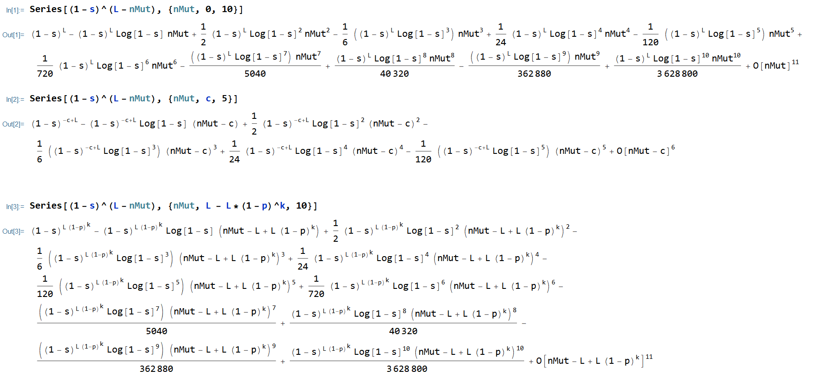
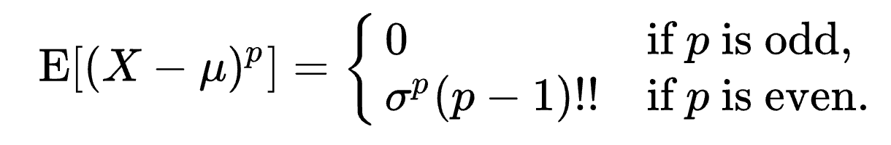
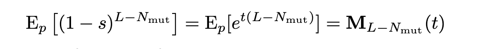

The idea is to take a Taylor series expansion, and then use linearity of expectations. The Taylor expansion is as follows:

Using the following:

we get:

Therefore, probably there is not much point in pursuing this. We already tried it before and left it.
