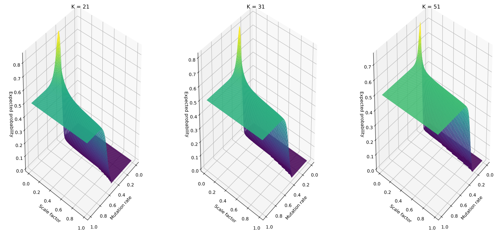
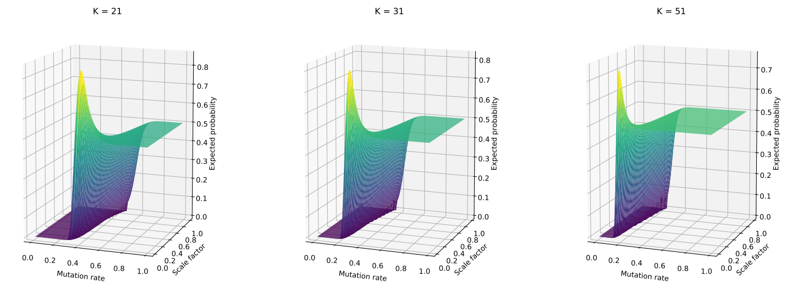
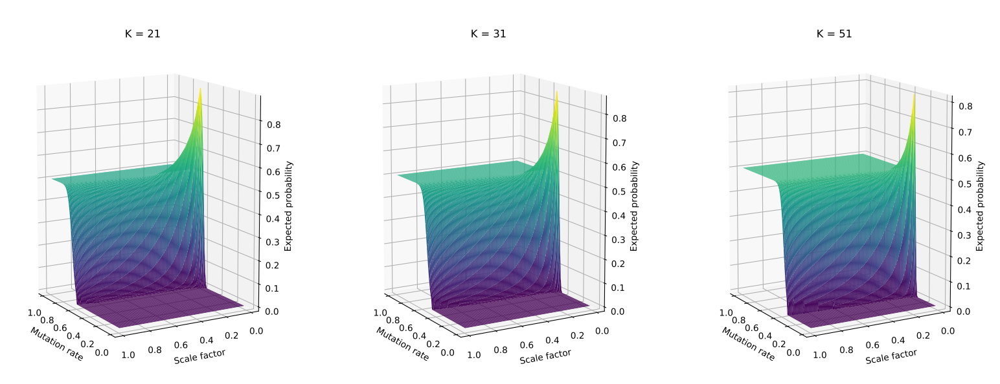
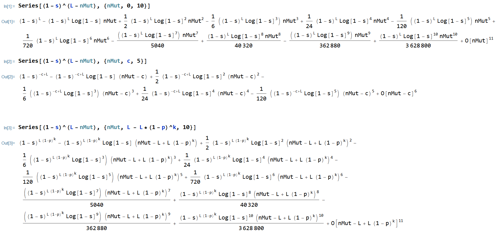
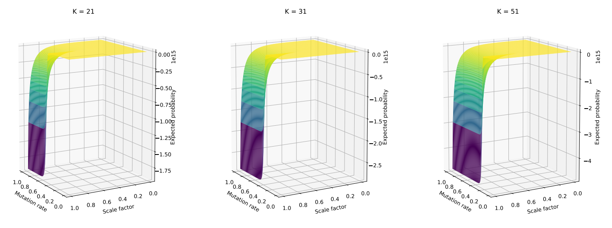

## Overview
The codes in this directory are used to calculate the expected probability of the cases where there is nothing common between the sketches.

To get nothing common in two sketches, there are $`L-N_{mut}`$ k-mers that are not mutated by the mutation process, and all of these need to be thrown out while taking a sketch. The probability of that happening is $`(1-s)^{L - N_{mut}}`$. Next, using mathematics, we can calculate the expectation of this probability.

The python file implements this expected probability. The pdf files are sample plots.

### plot_expected_probability_of_pathological_cases.python

This is the code used to plot the expected probability. The other files are used to make the whole thing run.

#### Results

The results from running this script are the PDF files in this directory (from different viewpoints). For example, if we look at `combined2.pdf`, we will see three figures for different k-mer sizes. In each of these figures, for a fixed `L = 10^9`, we see the expected probability for all scale-factors and mutation rates. Because this is a 3D plot, we change the viewing direction in the other files.

1. combined.pdf: L = 10^9
1. combined2.pdf: L = 10^9
1. combined3.pdf: L = 10^9
1. combined4.pdf: L = 10^12

**L=10^9**




**L=10^12**



These plots reveal the range of scale-factors and mutation-rates for which our confidence intervals are not going to have any trouble. It shows that with increased scale-factor, the probability of finding nothing common in the two sketches decreases. The plots also show that with larger mutation rate, we would need to use a larger scale-factor. We can also see that with increased k-mer size and decreased L, the range where our intervals work well shrinks, as expected.

### check_expected_probability_against_simulations.py
In this script, the code to run the following experiment resides: since we do not know if the formula (for expected probability of having nothing common in the sketches) is correct, we calculate the probability of finding nothing in common in the two sketches (before and after the mutation process) from multiple simulations, and compare the value with what our formula spits out.

#### Results
For 10k simulations, we calculated if nothing common in the sketches. We count the # of times
this happens. We also counted the percentage of times this happens from all the experiments. Then we compared and made a contrast
with the value we have from formula. The results are as follows:

|L|k|scale_factor|mutation_rate|estimated_from_experiments|estimated_from_formula
|---|---|---|---|---|---|
|10000|21|0.1|0.2|0.001|0.00299|
|10000|31|0.1|0.2|0.491|0.302|
|10000|21|0.1|0.3|0.6292|0.434|
|10000|31|0.1|0.3|0.9877|0.520|
|10000|21|0.1|0.4|0.9811|0.544|
|10000|31|0.1|0.4|1.0|0.504|

With these results, we can conclude that this formula has something seriously wrong. We need to figure that out.

##### Problems:
1. Discrepancy in the figures in this table
1. The problem we have is: we have an expression for the expected probability of nothing common in sketches. The formula has some issues. At scale_factor = 0, the probability rises, then falls. Conceptually, it should just be 1.0, as we are making sure that there is nothing common in the sketches.

#### Ideas

1. Try the PDF
1. Consider two random processes at the same time
1. Try area correction
1. Taylor expansion
1. Check literature for PMF of sum of m-dependent Bernouli


### Area correction
Sep 8, 2021

When we approximate a discrete distribution (for example, N_mut) with a continuous distribution (such as the normal distribution), we often have to do area correction. By using that, probability(N_mut = n) = intergration of continuous PDF from n-0.5 to n+0.5. The range of N_mut is [0, L]. Therefore, we scale the PMF by scaling with a factor of the integration from -0.5 to L+0.5.

This is implemented the file `check_expected_probability_against_simulations.py` as follows:

```
def exp_probability_path_case_are_correction(L, k, p, s):
    mu = L * (1-p)**k
    sigma = sqrt(var_n_mutated(L, k, p))
    f = lambda a, b: 0.5 * ( erf( (mu-a)/(sqrt(2)*sigma) ) - erf( (mu-b)/(sqrt(2)*sigma) ) )
    delta = f(-0.5, L+0.5)
    probability = lambda n: f(n-0.5, n+0.5)/delta
    expected_probability = 0.0
    for n in range(L+1):
        expected_probability += ((1-s)**n)*probability(n)
    return expected_probability
```

Implementation notes: `f = lambda a, b: 0.5 * ( erf( (mu-a)/(sqrt(2)*sigma) ) - erf( (mu-b)/(sqrt(2)*sigma) ) )` is the integral from a to b.

After implementing this, we calculated the expected probability from multiple simulations, and compared with what we get from the formula. The results are as follows.

|L|k|scale_factor|mutation_rate|estimated_from_experiments|estimated_from_formula
|---|---|---|---|---|---|
|10000|21|0.1|0.2|0.001|0.003|
|10000|31|0.1|0.2|0.491|0.362|
|10000|21|0.1|0.3|0.6292|0.529|
|10000|31|0.1|0.3|0.9877|0.942|
|10000|21|0.1|0.4|0.9811|0.940|
|10000|31|0.1|0.4|1.0|0.999|

This shows that there is still room for improvement. Still, the formula looks way better than the previous, which never got values close to 1.0 (stuck at around 0.5).

### Getting a lower bound

This has been proved by David. Check the notebook PDF on dropbox for the proof. In short, it has been mathematically proved that the expected probability is at least (>=) (1-s)^[L*(1-p)**k]. Implemented this is: `check_expected_probability_against_simulations.py`.

```
def exp_probability_path_case_david(L, k, p, s):
    return (1-s)**(L*(1-p)**k)
```

Indeed, by matching with simulations, we see the following:

|L|k|scale_factor|mutation_rate|estimated_from_experiments|estimated_lower_bound
|---|---|---|---|---|---|
|10000|21|0.1|0.2|0.001|6e-5|
|10000|31|0.1|0.2|0.491|0.352|
|10000|21|0.1|0.3|0.6292|0.555|
|10000|31|0.1|0.3|0.9877|0.983|
|10000|21|0.1|0.4|0.9811|0.977|
|10000|31|0.1|0.4|1.0|0.9998|

At least for this very brief set of experiments, the lower bound seems to be working.

### Using trapezoidal rules for area correction

In the meeting, we discussed that what we are currently doing is summing area of rectangles. However, we are not. We are directly integrating the PDF of Normal distribution. Therefore, I believe this is just a failed and misdirected idea.

### Taylor expansion

The idea is that, we are trying to calculate the expectation of *(1 - s)^(L - N_mut)*. We can simply do a Taylor expansion and use linearity of expectation. We have multiple options for choosing the point, around which, we will do the series expansion. For now, I am thinking about trying:

1. around *N_mut = 0*
1. around *N_mut = L - L(1-p)^k* (the expected value of N_mut)
1. around *N_mut = L*

Expansions around these three points give us:



All of these expansions are correct. Computationally, the most tractable is around *N_mut = 0*. We have to first check if the terms in the expansion gradually decrease or not. If they do not decrease, we are in trouble.

#### A test: verify that the terms in expansion are decreasing, otherwise, it is not converging

Implemented code:

```
	term1 = (1-s)**(L)
    term2 = -1.0 * (1-s)**(L) * log(1-s) * exp_n_mutated(L, k, p)
    term3 = 0.5 * (1-s)**(L) * ( log(1-s) )**2 * exp_n_mutated_squared(L, k, p)
    term4 = -1.0/6.0 * (1-s)**(L) * ( log(1-s) )**3 * exp_n_mutated_cubed(L, k, p)
    print (term1, term2, term3, term4)
    return sum([term1, term2, term3, term4])
```

These are the terms in the Taylor expansion around *N_mut = 0*. Setting L = 10000, *(1-s)^L* is always giving zero (all four terms are zero). Therefore, we may have to try expansion around some other point. *N_mut = Expectation(N_mut)* may be a good choice?

Expanded around the mean, and implemented the code, we have:

```
def exp_probability_path_case_taylor(L, k, p, s):
    c = exp_n_mutated(L, k, p)
    term1 = (1-s)**(L-c)
    term2 = -1.0 * (1-s)**(L-c) * log(1-s) * (exp_n_mutated(L, k, p) - c)
    term3 = 0.5 * (1-s)**(L-c) * ( log(1-s) )**2 * (exp_n_mutated_squared(L, k, p) - c**2)
    term4 = -1.0/6.0 * (1-s)**(L-c) * ( log(1-s) )**3 * (exp_n_mutated_cubed(L, k, p) - 3*c*exp_n_mutated_squared(L, k, p) + 2*c**3)
    print (term1, term2, term3, term4)
    return sum([term1, term2, term3, term4])
```

Setting **L=10k, p=0.1, s=0.1, k=21**, the four terms we get are:

0.5551667263098173
0.0
0.09704498900245742
-0.028507430896310162

As we can see, the magnitude keeps decreasing. This seems to be a good choice. A nice thing is that the lower bound (proved by David using Jensen's inequality) is already here as the first term. Comparing this with simulations, we have the following results:

|L|k|scale_factor|mutation_rate|estimated_from_experiments|estimated_from_formula
|---|---|---|---|---|---|
|10000|21|0.1|0.2|0.001|0.0002|
|10000|31|0.1|0.2|0.506|0.444|
|10000|21|0.1|0.3|0.637|0.623|
|10000|31|0.1|0.3|0.991|0.987|
|10000|21|0.1|0.4|0.975|0.981|
|10000|31|0.1|0.4|1.0|0.999|

Turns out, this is the best formula, compared to the others we did before.

|L|k|sc_factor|mut_rate|estim_from_expt|moment_gen|lower_bound|area_correctn|taylor|
|---|---|---|---|---|---|---|---|---|
|10000|21|0.1|0.2|0.0015	|0.002987192	|6.02E-05		|0.003021206	|0.000206504
|10000|31|0.1|0.2|0.489	|0.302061618	|0.352240884	|0.362864577	|0.444218232
|10000|21|0.1|0.3|0.628	|0.434346784	|0.555166726	|0.529025538	|0.623704284
|10000|31|0.1|0.3|0.9865	|0.520719609	|0.983514109	|0.942618945	|0.986951009
|10000|21|0.1|0.4|0.9775	|0.543902029	|0.977152172	|0.94021608		|0.98092972
|10000|31|0.1|0.4|1		|0.504148401	|0.999860255	|1				|0.999882557


To show that this is the best, we show percentage discrepancy of each formula with the simulation average, and present them as follows:

|L|k|sc_factor|mut_rate|% deviation moment_gen|% deviation lower_bound|% deviation area_correctn|% deviation taylor|
|---|---|---|---|---|---|---|---|
|10000|21|0.1|0.2|99.14614161|95.98648258|101.4137373|86.23308153
|10000|31|0.1|0.2|38.22870793|27.96709933|25.79456499|9.157825774
|10000|21|0.1|0.3|30.83649938|11.59765505|15.76026469|0.684031144
|10000|31|0.1|0.3|47.21544768|0.302675221|4.448155581|0.045718123
|10000|21|0.1|0.4|44.35784874|0.035583387|3.814211724|0.350866473
|10000|31|0.1|0.4|49.58515992|0.013974501|3.78E-11|0.011744305

Next stepwould be to calculate the PMF directly and see if we can get some improvements.

** Unfortunately, calculating the PDF is not so simple! Perhaps we have to be content with the formula derived by taking expectation after doing Taylor series expansion. **

Plotting the formula obtained from using Taylor approximation, we get the following:



This seems counter-intuitive. We have some explaining to do regarding this!

